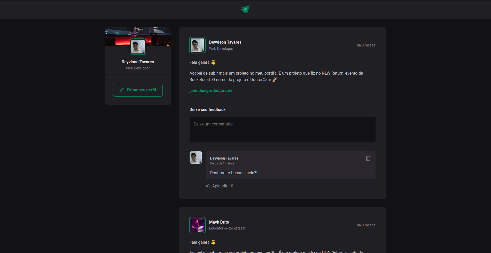

<h1 align="center">
    
</h1>

<h4 align="center"> 
     Aplicação Concluída!! 	
</h4>

 <a href="#-sobre-o-projeto">Sobre</a> •
 <a href="#-funcionalidades">Funcionalidades</a> •
 <a href="#-layout">Layout</a> • 
 <a href="#-como-executar-o-projeto">Como executar o site</a> • 
 <a href="#-tecnologias">Tecnologias</a> • 
 <a href="#-autor">Autor</a> • 
 <a href="#user-content--licença">Licença</a>

## 💻 Sobre o projeto

Este projeto consiste em simular um feed de rede social feito com
React no front-end usando typescript.
Usa css module na estilização.
Usa hooks do tipo useState useEffect.
Usa a biblioteca de icons phosphoricons.
Usa "date-fns" para lidar com o formato de datas.
Criação de componentes que conversam
entre si, usando props

---

- [x] Criar comentarios
- [x] Deletar comentarios
- [x] Aplaudir(dar like)
- [x] Responsivo
- [x] botão validado

### Mobile

  

  

  

---

### Web

  

  

  

---

## 🚀 Como ver o projeto/site

basta acessar o o link
[IgniteFeed](https://www.linkedin.com/in/deyvison-tavares/recent-activity/)

---

## 🛠 Tecnologias

As seguintes ferramentas foram usadas na construção do projeto:

#### **Website**/ ([Html](https://devdocs.io/html//) + [Module.css](https://github.com/css-modules/css-modules) + [Ts](https://www.typescriptlang.org/docs/) + [ReactJs](https://pt-br.reactjs.org/docs/cdn-links.html))

---

## 🦸 Autor

 
<a href="https://github.com/DeyvisonTav">
 
  
  
 <b>Deyvison Tavares</b>🚀</a>
  
  

---

## 📝 Licença

Este projeto esta sobe a licença [MIT](./LICENSE).

Feito com ❤️ por Deyvison Tavares 👋🏽 [Entre em contato!](https://www.linkedin.com/in/deyvison-tavares/)
